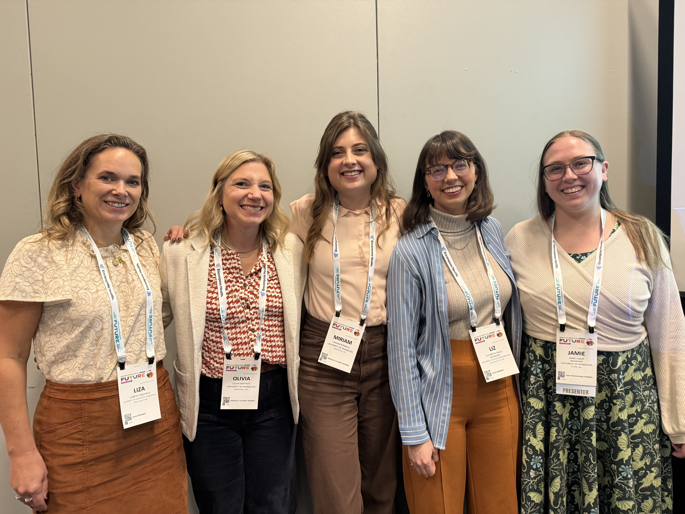
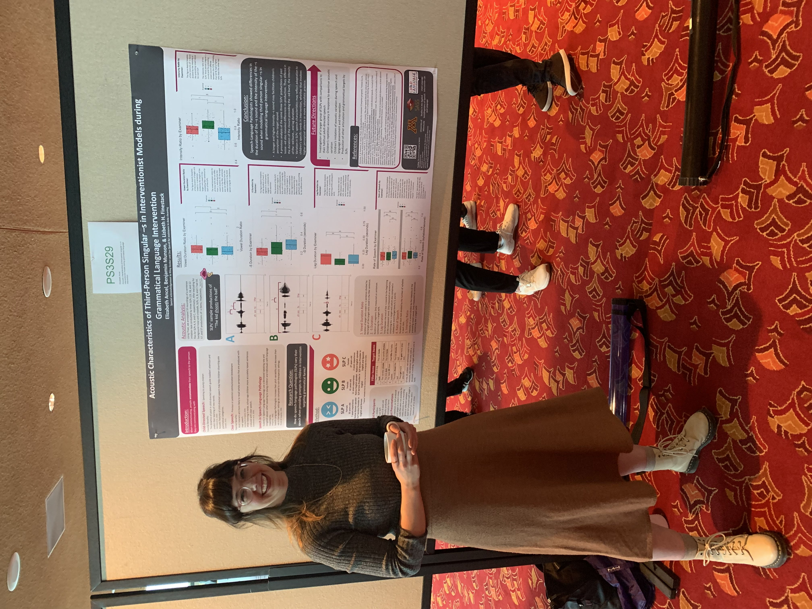
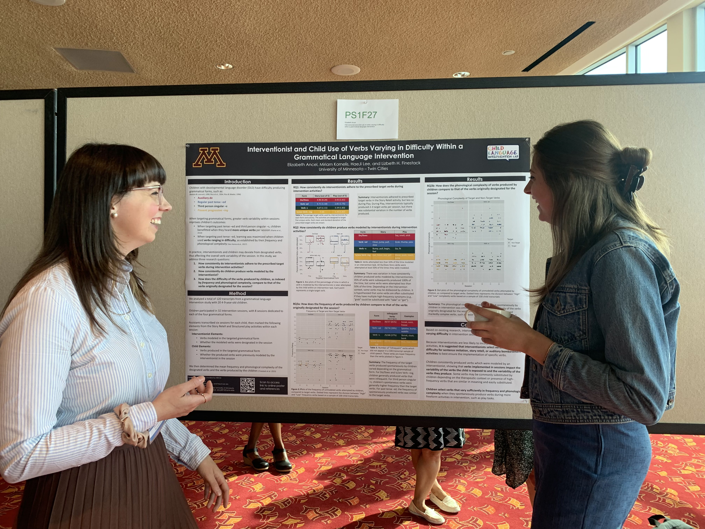
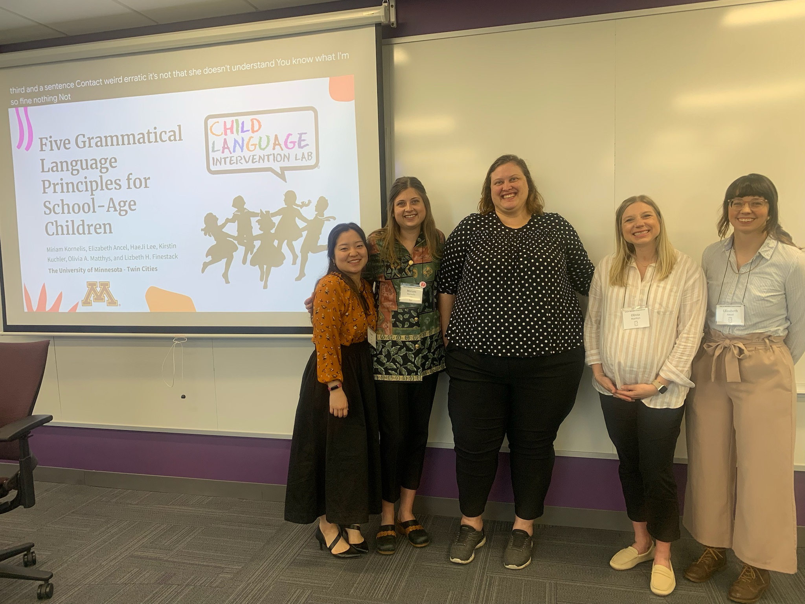
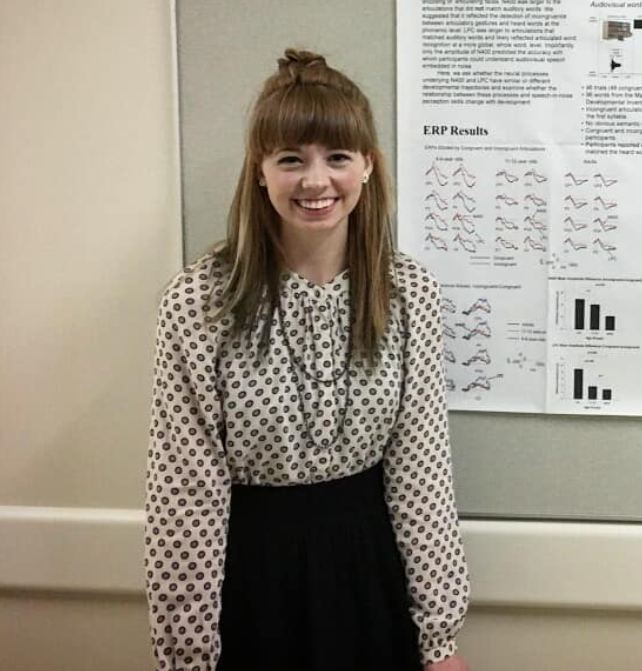

<b>Publications:</b>

Munson, B. & <b>Ancel, E.</b> (2026). Afterword. In Babatsouli, E., Holt, Y. F., & Washington, K. N. (Eds.) Linguistic varieties in North America: A guide for speech and language practitioners. Multilingual Matters Limited. https://doi.org/10.21832/BABATS2682

Lee, H., <b>Ancel, E.</b>, Ebert, K., & Munson, B. (2026). Racial identity perception, social affiliation, and sentence repetition in children. Journal of Speech, Language, and Hearing Research, 1-10. https://doi.org/10.1044/2025_JSLHR-24-00771

<b>Ancel, E.,</b> Munson, B., Winn, M. B., & Finestack, L. H. (2025). A preliminary investigation into the acoustic variability of examiners’ productions in language assessments. J. Acoust. Soc. Am., 157(5), 3256-3266. https://doi.org/10.1121/10.0036556

<b>Ancel, E.</b>, Smith, M.L., Rao, V.N.V., & Munson, B. (2023). Relating Acoustic Measures to Listener Ratings of Children’s Productions of Word-Initial /ɹ/ and /w/. Journal of Speech, Language, and Hearing Research, 1-15. https://doi.org/10.1044/2023_JSLHR-22-00713

Finestack, L. H., <b>Ancel, E.</b>, Lee, H., Kuchler, K., & Kornelis, M. (2023). Five Additional Evidence-Based Principles to Facilitate Grammar Development for Children with Developmental Language Disorder. American Journal of Speech-Language Pathology, 1-12. https://10.1044/2023_AJSLP-23-00049

Finestack, L. H., Linert, J., <b>Ancel, E.</b>, Kuchler, K., & Matthys, O. (2023). Verbs matter: A tutorial for determining verb difficulty. American Journal of Speech-Language Pathology, 1-18. https://doi.org/10.1044/2023_AJSLP-22-00333

Kaganovich, N., & <b>Ancel, E.</b> (2019). Different neural processes underlie visual speech perception in school-age children and adults: An event-related potentials study. Journal of Experimental Child Psychology, 184, 98-122. https://doi.org/10.1016/j.jecp.2019.03.009

<b>Presentations:</b>

<b>Ancel, E.</b>, Munson, B., Ebert, K., & Finestack, L. F. (November 2026) The Way We Talk: How Clinician’s Use of Child-Directed Speech Affects Children’s Language Outcomes [Accepted oral presentation]. The American Speech-Language-Hearing Association Convention, Indianapolis, IN, United States. 

Finestack, L.F., <b>Ancel, E.</b>, Hallberg, G., Lee, H., Linert, J., & Matthys, O. (November 2026) The Grammar Toolkit: Evidence-based Assessment and Intervention for Children with DLD [Accepted oral presentation]. The American Speech-Language-Hearing Association Convention, Indianapolis, IN, United States. 

Kornelis, M., <b>Ancel, E.</b>, Linert, J., Lee, H., Matthys, O., & Finestack, L. H. (November 2026) An Efficient Grammatical Tool for Identifying Targets and Measuring Progress in School-Age Intervention [Accepted oral presentation]. The American Speech-Language-Hearing Association Convention, Indianapolis, IN, United States.

<b>Ancel, E.</b>, Hooyman, T., Schabes, C., & Sterling, A. (November 2026) Characteristics of Assessors' Speech to Children Based on Age, Language Ability, and Autistic Traits  [Accepted poster presentation]. The American Speech-Language-Hearing Association Convention, Indianapolis, IN, United States. 

<b>Ancel, E.</b>, Elmquist, M., Kornelis, M., Finestack, L. H., & Sterling, A. (October 2026) Predicting Accuracy of LENA Automated Speaker Labeling for Young Children with Down Syndrome [Accepted poster presentation]. 58th Annual Gatlinburg Conference, Minneapolis, MN, United States.

<b>Ancel, E.</b>, Winn, M. B., Finestack, L. H., & Munson, B. (September 2026) Acoustic characteristics of speech-language pathologists’ productions based on perceived age and language ability of the listener [Accepted poster presentation]. UW-Madison Postdoctoral Research Symposium, Madison, WI, United States. 

Matthys, O., <b>Ancel, E.</b>, Kornelis, M., Lee, H., Linert, J., Spoden, A., & Finestack, L. H. (November 2025) From Assessment to Intervention: Case-Based Grammar Intervention for Children with DLD [Oral presentation]. The American Speech-Language-Hearing Association Convention, Washington, D.C., United States. 

Lee, H., <b>Ancel, E.</b>, Ebert, K., & Munson, B. (November 2025) Racial Identity Perception, Social Affiliation, and Sentence Repetition in Children [Poster presentation]. American Speech-Language-Hearing Association Convention, Washington D.C., United States. 

Ancel, E., Winn, M. B., Finestack, L. H., & Munson, B. (May 2025) Acoustic characteristics of speech-language pathologists’ productions based on perceived age and language ability of the listener \[Poster presentation\]. 188th Meeting of the Acoustical Society of America, New Orleans, LA, United States.

Kornelis, M., Ancel, E., Lee, H., Kuchler, K., & Finestack, L. H. (November 2024) Implementing evidence-based grammatical language intervention principles into practice \[Oral presentation\]. The American Speech-Language-Hearing Association Convention, Seattle, WA, United States.

Finestack, L. H., Kornelis, M., Ancel, E., & Kuchler, K. (July 2024) The Impact of Verb Difficulty on the Accuracy of Verb Usage by Children with DLD \[Poster presentation\] XVIth International Congress for the Study of Child Language. Prague, Czech Republic.

<b>Ancel, E.</b>, Munson, B., & Finestack, L. H., (May 2024) Acoustic characteristics of singular -s in interventionist models during grammatical language intervention. \[Poster presentation\] Symposium on Research in Child Language Disorders, Madison, WI, United States.

Lee, H., <b>Ancel, E.</b>, Munson, M., (May 2024) Racial Identity Perception, Social Affiliation, and Sentence Repetition in Children. \[Poster presentation\] Symposium on Research in Child Language Disorders, Madison, WI, United States.

<b>Ancel, E.</b>, Kornelis, M., & Finestack, L. H., (May 2024) Interventionist and child use of verbs varying in difficulty within a grammatical language intervention. \[Poster presentation\] Symposium on Research in Child Language Disorders, Madison, WI, United States.

Kornelis, M., <b>Ancel, E.</b>, Lee, H., Kuchler, K., Matthys, O., & Finestack, L. H., (2024, April 27) Five Grammatical Language Intervention Principles for School-Aged Children. \[Oral presentation\] Minnesota Speech-Language-Hearing Association Convention, Minneapolis, MN, United States.

<b>Ancel, E.</b>, Munson, B., & Finestack, L. H., (November 2023) Acoustic Variability of Interventionists’ Productions During Sentence Imitation. \[Poster presentation\] American Speech-Language-Hearing Association Convention, Boston, MA, United States.

<b>Ancel, E.</b>, Lee, H., Kornelis, M., Kuchler, K., Matthys, O., & Finestack, L. H., (November 2023) Five Principles to Consider When Targeting Grammatical Forms. \[Oral presentation\] American Speech-Language-Hearing Association Convention, Boston, MA, United States.

Kuchler, K., Kornelis, M., <b>Ancel, E.</b>, Lee, H., & Finestack, L. H., (November 2023) Implementation Feasibility of an Explicit-based Intervention Targeting Grammatical Verb Forms for Children with DLD. \[Poster presentation\] American Speech-Language-Hearing Association Convention, Boston, MA, United States.

<b>Ancel, E.</b>, Munson, B., & Finestack, L. H. (May 2023). Acoustic Variability of Examiners’ Productions During Language Assessment. \[Poster presentation\]. 185th Meeting of the Acoustical Society of America, Chicago, IL, United States.

<b>Ancel, E.</b> (May 2023). Active Cultural Responsivity to Terminology in Speech and Hearing Science. \[Oral presentation\]. 185th Meeting of the Acoustical Society of America, Chicago, IL, United States.

Lee, H., Kornelis, M., <b>Ancel, E.</b>, Matthys, O., & Finestack, L. H. (April 2023) Verbs matter! Intervention approaches to consider when targeting grammatical forms. \[Oral presentation\] Minnesota Speech-Language-Hearing Association Convention, Virtual.

<b>Ancel, E</b> (March 2023) Linguistic Diversity. \[Guest Lecture\] EPSY 3132: Psychology of Multiculturalism in Education, Univeristy of Minnesota.

Munson, B. & <b>Ancel, E.</b> (November 2022) How Chidlren Learn Gendered Speech, and Why It Matters for Speech-Language Pathology. \[Oral presentation\] American Speech-Language-Hearing Association Convention, New Orleans, LA, United States.

<b>Ancel, E.</b>, Kuchler, K., Linert, J., Matthys, O., & Finestack, L. H. (November 2022) Verbs matter! Intervention approaches to consider when targeting grammatical forms. \[Oral presentation\] American Speech-Language-Hearing Association Convention, New Orleans, LA, United States.

<b>Ancel, E.</b>, Smith, M. L., Rao, V. N. V., & Munson, B. (November 2021). Does F3-F2 distance predict transcriptions of preschoolers’ /r/ productions? \[Poster presentation\]. 181st Meeting of the Acoustical Society of America, Seattle, WA, United States.

Kaganovich, N., & <b>Ancel, E.</b> (February 2018). Audiovisual Word-Matching in School-Age Children: An ERP Study \[Poster presentation\]. Ringel Evidence-Based Practice Symposium, West Lafayette, IN, United States.

Kaganovich, N., & <b>Ancel, E.</b> (October 2017). Audiovisual Word-Matching in School-Age Children: An ERP Study \[Poster presentation\]. Crossroads Conference on Communicative Disorders, West Lafayette, IN, United States.
